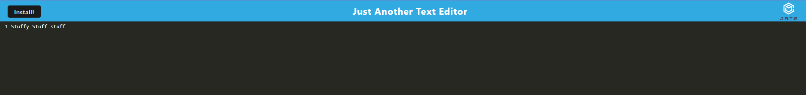

  
  # text-editor

  ## Description
  
  text-editor is a PWA that allows the user to save text locally utilizing the browser-provided indexedDB.
  
  ## Table of Contents 
  
  - [Installation](#installation)
  - [Usage](#usage)
  - [Questions](#questions)
  
  ## Installation
  
  From the root of the repo, simply run "npm install" followed by "npm start". the website will be live at localhost:3000 by default.
  
  ## Usage
  
  To use the app, simply type into the black background area. The text is automatically saved whevever that element is unfocused.
  
  ## License

  note-taker is available under the MIT-0 license.
  For more information on the license, visit this [link](https://opensource.org/license/MIT-0/
  )

  ## Questions
  
  For any questions, feel free to contact me through either of these options: 
  
  -[Github](https://github.com/kev-rod43)
  
  -Email: kev.rod43@yahoo.com